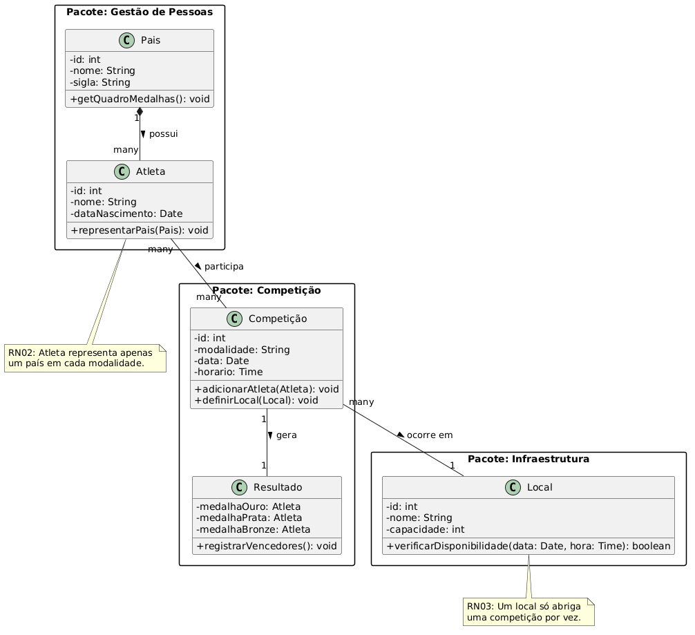
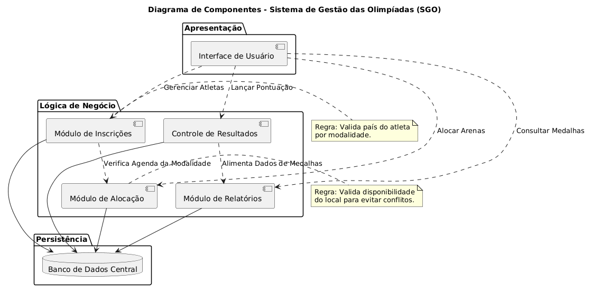
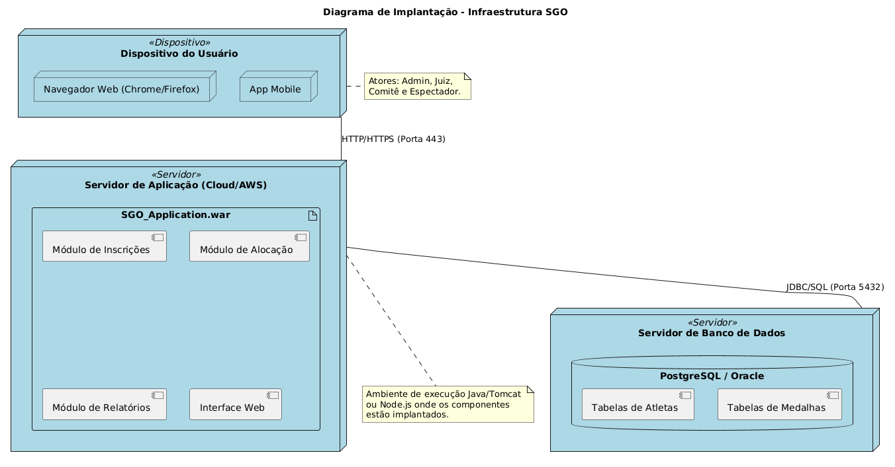

# Sistema de Gestão das Olimpíadas (SGO)

## Descrição do Projeto
Este sistema foi desenvolvido como parte das atividades de Engenharia de Software na PUC Minas. O objetivo é coordenar os principais processos das Olimpíadas, desde o planejamento de competições e alocação de arenas até o controle rigoroso de atletas e do quadro de medalhas oficial.

## Histórias de Usuário (User Stories)

*   **US01 - Cadastrar Modalidade:** Como Administrador, quero cadastrar uma nova modalidade esportiva para que ela fique disponível no evento.
*   **US02 - Definir Cronograma:** Como Administrador, quero definir a data e o horário de uma competição para organizar o cronograma oficial.
*   **US03 - Vincular Local:** Como Administrador, quero vincular uma competição a um local físico para que o público e atletas saibam onde ir.
*   **US04 - Cadastro de Atletas:** Como Comitê Nacional, quero cadastrar atletas do meu país no sistema para que eles possam ser inscritos nas provas.
*   **US05 - Inscrição em Competição:** Como Comitê Nacional, quero inscrever um atleta em uma competição específica para garantir sua participação.
*   **US06 - Validar Nacionalidade:** Como Sistema, devo impedir que um atleta represente mais de um país na mesma modalidade para manter a integridade das regras.
*   **US07 - Listagem de Credenciamento:** Como Organizador, quero visualizar a lista de atletas inscritos em cada competição para fins de logística.
*   **US08 - Evitar Conflito de Arena:** Como Gestor de Logística, quero que o sistema bloqueie a alocação de um local se já houver outra competição no mesmo horário.
*   **US09 - Alterar Localização:** Como Administrador, quero poder alterar o local de uma prova em caso de necessidade técnica ou climática.
*   **US10 - Registrar Ouro:** Como Juiz, quero registrar o atleta vencedor (Medalha de Ouro) após o término da prova.
*   **US11 - Registrar Prata e Bronze:** Como Juiz, quero registrar os atletas que ficaram em segundo e terceiro lugar para completar o pódio.
*   **US12 - Gerar Quadro de Medalhas:** Como Analista de Dados, quero gerar um relatório de medalhas por país para atualizar o ranking oficial.
*   **US13 - Consulta Pública:** Como Espectador, quero consultar o local e horário de cada competição para planejar minha visita às arenas.
*   **US14 - Taxa de Ocupação:** Como Administrador, quero emitir um relatório de ocupação dos locais para otimizar o uso das infraestruturas.
*   **US15 - Validação de Dados:** Como Sistema, devo validar se todos os campos obrigatórios (data, hora, local) foram preenchidos antes de confirmar uma competição.

---

## Diagramas do Sistema

### 1. Diagrama de Caso de Uso
 

### 2. Diagrama de Classes

### 3. Diagrama de Pacotes

### 4. Diagrama de Componentes

### 5. Diagrama de Implantação

---

## Estrutura do Repositório
*   `/imagens`: Contém as exportações dos diagramas em formato PNG.
*   `/codigos`: Contém os arquivos fonte `.puml` utilizados no PlantUML.

**Desenvolvido por:** Davi Vinícius Barbosa de Oliveira
**Instituição:** PUC Minas
